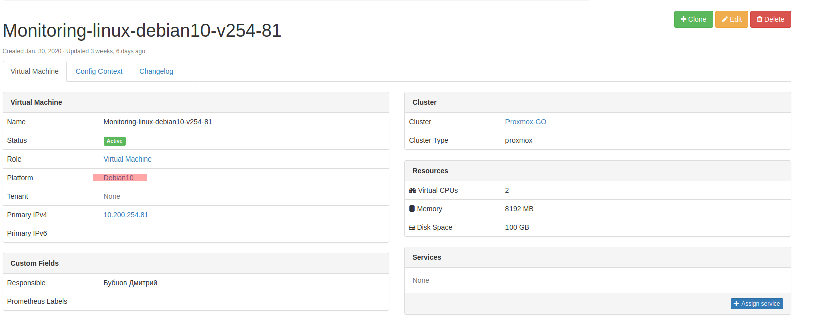
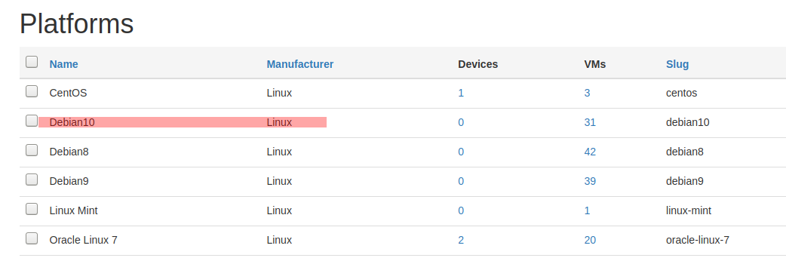

Service discovery for [Prometheus](https://prometheus.io/) using devices from [Netbox](https://github.com/digitalocean/netbox).

# Legal

This project is released under MIT license, copyright 2018 ENIX SAS.

# Contribute

Feel free to contribute to this project through Github pull-requests. We also
accept well formatted git patches sent by email to the maintainer.

Current Maintainer: Antoine Millet <antoine.millet __at__ enix.io>

# Requirement

This project requires Python 3 and [Pynetbox](https://github.com/digitalocean/pynetbox/).

ВМ в нетбоксе должны иметь обязательное поле Platform, описывающее ОС:


А этот Platform должен содержаться в Manufacturer: Linux или Microsoft. В завсимости от мануфактурера будет меняться порт экспортера (9100 для node_exporter (Linux) и 9182 для wmi_exporter (Windows)):



# Usage with Docker

`docker build -t netbox-prom  .`

`docker run -d --name=netbox-prom  -e NETBOX_URL=http://netbox.address:port -e NETBOX_TOKEN=token -e OUTPUT_FILE=linux.yml -e EXPORTER=linux -e INTERVAL=1 netbox-prom`

`docker run -d --name=netbox-prom  -e NETBOX_URL=http://netbox.address:port -e NETBOX_TOKEN=token -e OUTPUT_FILE=microsoft.yml -e EXPORTER=microsoft -e INTERVAL=1 netbox-prom`

EXPORTER - OS type: linux or microsoft

# Usage

```
usage: netbox-prometheus-sd.py [-h] [-p PORT] [-f CUSTOM_FIELD]
                               url token output 

positional arguments:
  url                   URL to Netbox
  token                 Authentication Token
  output                Output file
  exporter              linux | microsoft

optional arguments:
  -h, --help            show this help message and exit
  -p PORT, --port PORT  Default target port; Can be overridden using the
                        __port__ label
  -f CUSTOM_FIELD, --custom-field CUSTOM_FIELD
                        Netbox custom field to use to get the target labels
```

The service discovery script requires the URL to the Netbox instance, an
API token that can be generated into the user profile page of Netbox and a path
to an output file.

Optionally, you can customize the custom field used to get target labels in Netbox
using the `--custom-field` option. You can also customize the default port on which
the target will point to using the `--port` option. Note that this port can be customized
per target using the `__port__` label set in the custom field.

The output will be generated in the file pointed by the `output` argument.

In the Prometheus configuration, declare a new scrape job using the file_sd_configs
service discovery:

```
- job_name: 'netbox'
  file_sd_configs:
  - files:
    - '/path/to/my/output.json'
```
